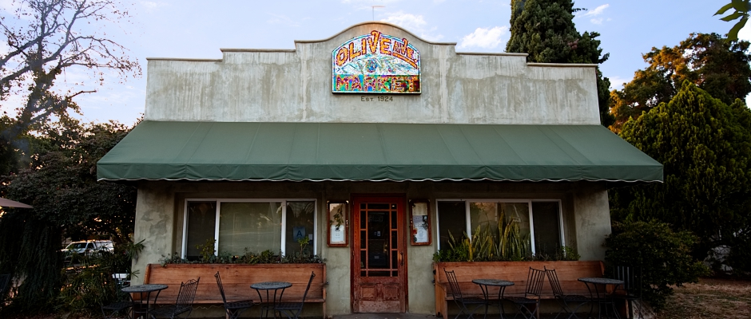

## Planning

- Trello
- Inspiration
- Plan
- People

Step 1:

- projector - 3d scene - single wall - reacts to your head moving

Step 2:

- 2 WALLS!
  - 2 panels at different angles
  - 2 different camera angles (so we need to move 2 cameras)

Step 3 (someday this weekend):

- Configurable (easer to configure)

4: build the room

5: multiple projectors per wall (includes floor maybe)

6: multiple tracking inputs

- maybe multiple iPhones
- would need a server

step 8: multiple projector outputs (video drivers) — chrome cast?

step 9: different scenes

- Targets as initial
- OR Jedi training droid
  - droid shooting lasers
- build a castle

## Materials

- Projectors

## Getting started

We started by working on face detection thinking this would be our plan:

ARKit
eyes
VisionFaceDetection (droids on roids)

We tried EVFaceTracker: (which doesn't use ARKit):

https://github.com/evermeer/EVFaceTracker

We got discouraged and decided to simplify. Knowing how to do the ditance and perspective calulations
on a wii-mote, we thought it would be easier to start there. Little did we know

wii-homebrew
https://github.com/JustinBis/wjoy-foohid (required disabling kext signing)
nodewii (doesn't work with modern osx)
noble (didn't detect, uses hacked XPC bindings)
noble-mac (modern version, worked, but didn't detect the wiimote)
node-bluetooth (detected the device, couldn't read/write)

We gave up and started looking into the 3d scene:

scenekit (worked, but was apple only, we knew that the scene rendering and vision would have to be separate)
unity (we knew there was a wiimote library, but couldn't figure out how to use it, also knew we couldn't figure out how to pipe in and out)
unity-wiimote (never got an example working)
three.js (could use sockets, could go back to vision based movement)

Found:
https://github.com/wiiuse/wiiuse
got it working, got three.js working
mixed in socket.io
express

# Day two

We got breakfast




### The plan

- Test range of wiimote
  - Done there is a lot more distance (16" - 13ft)
  - Angle of horizontal visibiliy seems questionable
  - Possible multiple wii remote inputs

```
13   956
12   948  L/R 959
11   941      954
10   933      945
9    922      936
8    911      926
7    894      911
6    870      892
5    840      865
4    729      828
3    712      761
2    543      626
```

- Left and right (with cursor position)

- Jumping back to face detection, get distance with three.js

  - figuring out distance math with iphone
  - socket to node server
  - smoothing/easing

- Multiple projectors at the same time
